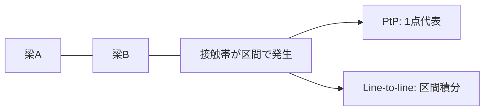

> 連載リンク: [梁梁接触#2: PtP接触の構造的問題](https://zenn.dev/gyp0bt/articles/beam-beam-contact-2-ptp-structural-issues)

## 梁梁接触は「実装テク」だけでは安定しない

:::message
梁梁接触が収束しにくい主因は、チューニング不足よりも**定式化の構造的な難しさ**にあります。

この記事ではまず「なぜ壊れやすいか」を整理し、解決策は後続記事で段階的に扱います。
:::

## 1. 背景: 線材問題では接触が支配的

撚線電線、医療用ワイヤ、ケーブル、ロッド構造などでは、素線同士の接触が全体応答を決めます。

- 曲げ・ねじり連成
- 繰返し荷重下での履歴応答
- 摩擦を伴う剛性変化

これらをソリッドで直接解くことは可能でも、設計探索を回すには梁モデル化が現実的です。

ただし、ここで典型的な壁にぶつかります。

> 梁梁接触は、すぐに収束が崩れる。

## 2. 本質: 接触は点ではなく分布現象

よくある実装は次の流れです。

1. 梁ペアごとに最近接点を1つ求める（PtP）
2. 法線ギャップ $g$ を評価する
3. ペナルティ法（または拡張ラグランジュ）で接触反力を入れる

この枠組みは単純ですが、平行近傍では接触帯が区間的に現れます。つまり実体は分布現象です。

1点に潰して扱うと、現象とモデルの間に不整合が残り、収束の不安定要因になります。

## 3. 最近接点は「解の一部」

接触条件は通常、

$$
g(u) \ge 0,\quad \lambda \ge 0,\quad g\lambda=0
$$

で書けますが、梁梁接触では $g$ が単純な $u$ 関数ではありません。

最近接点 $t$ は

$$
(x_A(s)-x_B(t))\cdot \mathbf{x}'_B(t)=0
$$

のような非線形条件で決まり、変形とともに移動します。したがって本質的には

$$
g=g(u,t(u))
$$

です。

にもかかわらず、実装で

- 変位更新
- 最近接再計算
- Newton 再開

という分離ループにすると、最近接移動の寄与が接線に十分入らず、予測精度が落ちます。結果として、ラインサーチ多発・収束次数低下が起きやすくなります。

## 4. ペナルティ法のジレンマ

ペナルティ法を

$$
\lambda=k\max(-g,0)
$$

とすると、

- $k$ が小さい: 貫入が増える
- $k$ が大きい: 接触剛性が支配し条件数が悪化する

というトレードオフが避けにくくなります。

| 設定 | 起きやすい現象 |
| --- | --- |
| 低ペナルティ | 貫入が目立つ |
| 高ペナルティ | 行列条件が悪化し反復が硬直 |

## 5. 何が壊れやすさを作るのか

整理すると、主要因は以下です。

1. 分布現象を点評価している
2. 最近接点の移動を未知変数系として一体化できていない
3. 相補性条件を緩和で処理し、剛性が過敏になる
4. 接触剛性が構造剛性を上回り、Newton 系が硬直する

要するに、問題は「実装の気合い不足」ではなく、定式化の設計にあります。

## 6. 連載の進め方

この連載では次の順序で再構成します。

- PtP の構造的限界の明確化
- Line-to-line による分布接触の定式化
- 最近接条件を含む一貫接線化
- 相補性を含むモノリシック Newton 解法

:::details この先で扱うこと
- #2: PtP の構造的限界
- #3: 最近接条件の陰関数微分
- #4: 一貫接線化とモノリシック解法
:::

> 次の記事: [梁梁接触#2: PtP接触の構造的問題](https://zenn.dev/gyp0bt/articles/beam-beam-contact-2-ptp-structural-issues)
