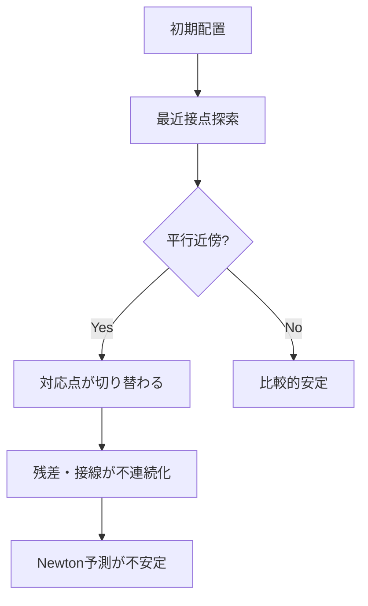

> 連載リンク: [梁梁接触#1: なぜ梁接触は壊れやすいのか？](https://zenn.dev/gyp0bt/articles/beam-beam-contact-1-why-fragile)

この記事では、梁同士の接触がなぜ収束不安定になりやすいのかを、**Point-to-Point（PtP）接触の構造的な限界**から整理します。結論としては、平行近傍では「接触を1点に潰す」仮定が破綻しやすく、Line-to-line への移行が自然です。

:::message
**先に要点**

- 平行近傍では接触は点ではなく帯として現れやすい
- PtP は最近接点の切り替わりで残差・接線が不連続化しやすい
- Line-to-line は区間積分で分布として扱え、一貫接線化とも整合しやすい
:::

## 1. PtP が平行近傍で不安定化しやすい理由

2本の中心線を

$$
\mathbf{x}_A(s),\quad \mathbf{x}_B(t)
$$

距離を

$$
d(s,t)=\|\mathbf{x}_A(s)-\mathbf{x}_B(t)\|
$$

とします。PtP は最近接点対 $(\hat s,\hat t)$ を

$$
(\hat s,\hat t)=\operatorname{argmin}_{s,t}\;\|\mathbf{x}_A(s)-\mathbf{x}_B(t)\|
$$

で1つ選び、その点だけで接触を評価します。

## 2. 「ゼロ集合」の形が PtP 仮定と噛み合わない

接触条件を

$$
g(s,t)=d(s,t)-R
$$

と置くと、接触集合は

$$
\Gamma_c=\{(s,t)\mid g(s,t)=0\}
$$

で与えられます。ここで重要なのは、$\Gamma_c$ が

- 孤立点になる場合もあれば
- 曲線や帯になる場合もある

という点です。PtP は暗黙に「孤立点」を前提にします。したがって帯状接触が現れる領域では、モデル仮定と現象の間に構造的不整合が残ります。

## 3. Line-to-line は接触を分布として扱う

Line-to-line では、A側区間 $[s_1,s_2]$ 上で接触寄与を積分します。例えばペナルティポテンシャルを

$$
\Pi_c=
\int_{s_1}^{s_2}
\frac12\,k\,\langle -g(s,t(s))\rangle^2\,ds
$$

と書きます（$\langle\cdot\rangle$ は Macaulay 括弧）。実装は通常 Gauss 積分です。

この形にすると、接触反力は「点荷重」ではなく「分布力」として現れ、平行近傍での局所的不連続を平均化しやすくなります。

## 4. 最近接対応 $t(s)$ は未知変数の従属関係

対応 $t(s)$ は補助量ではなく、投影条件

$$
\phi(s,t)=(\mathbf{x}_A(s)-\mathbf{x}_B(t))\cdot \mathbf{x}_B'(t)=0
$$

を満たす量として定まります。つまり $t$ は変位 $u$ の変化に追従するため、

$$
\phi(s,t(s))=0
$$

という陰関数関係を持ちます。

## 5. 一貫接線化では $dt/du$ を落とせない

ギャップは

$$
g(s)=d(s,t(s))-R
$$

なので、$u$ 微分は

$$
\frac{dg}{du}
=
\frac{\partial g}{\partial u}
+
\frac{\partial g}{\partial t}\,\frac{\partial t}{\partial u}
$$

となります。

:::message alert
**実装上の注意**

$dt/du=0$ とみなすと、最近接対応の変化が接線から消えます。結果として線形化が欠損し、Newton 法の収束性が崩れます。
:::

## 6. まとめ

| 論点 | PtP | Line-to-line |
| --- | --- | --- |
| 接触表現 | 1点評価 | 区間積分 |
| 平行近傍の安定性 | 低下しやすい | 改善しやすい |
| 一貫接線化との整合 | 切替点で難しい | 組み込みやすい |

次回は、$dt/du$ を含む具体的な一貫接線化と、相補性条件を含むモノリシック解法の形まで進めます。

> 前の記事: [梁梁接触#1: なぜ梁接触は壊れやすいのか？](https://zenn.dev/articles/beam-beam-contact-1-why-fragile)
