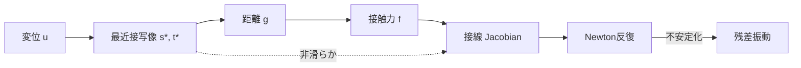

> 連載リンク: [梁梁接触#1: なぜ梁接触は壊れやすいのか？](https://zenn.dev/gyp0bt/articles/beam-beam-contact-1-why-fragile)

第一回では「梁接触は収束しにくい」という現象を確認しました。今回はその原因を、実装テクニックではなく**写像の微分構造**として分解します。

結論を先に書きます。

**PTP接触は、非滑らかな合成写像をNewton法で直接叩いているため、構造的に破綻しやすい。**

---

## 0. 導入（最小限）

- 第一回の要約: 梁接触はとくに幾何が厳しい場面で収束が不安定
- 今回の焦点: 「なぜ」を数式で特定する
- 立場: 問題は実装の巧拙より、**最近接写像の構造**にある

---

## 1. PTP距離関数の定義

2本の梁中心線を

$$
\mathbf{x}_1(s), \quad \mathbf{x}_2(t)
$$

とします。最近接条件は

$$
(s^*, t^*) = \arg\min_{s,t} \|\mathbf{x}_1(s) - \mathbf{x}_2(t)\|
$$

距離関数は

$$
g = \|\mathbf{x}_1(s^*) - \mathbf{x}_2(t^*)\|
$$

です。

ここで重要なのは、\(s^*, t^*\) が独立自由度ではない点です。これは未知変数ではなく、変位状態に対して**最小化で決まる従属量**です。

この時点で、すでに写像は

$$
\mathbf{u} \rightarrow (s^*, t^*) \rightarrow g
$$

という合成になっています。

---

## 2. 接触力とヤコビアン

Penalty法を例にすると接触力は

$$
\mathbf{f} = k\,g\,\mathbf{n}
$$

法線は

$$
\mathbf{n}=
\frac{\mathbf{x}_1(s^*) - \mathbf{x}_2(t^*)}{g}
$$

です。Newton法で必要なのは

$$
\frac{\partial \mathbf{f}}{\partial \mathbf{u}}
$$

ですが、\(g\) は

$$
g(\mathbf{u})=
\|\mathbf{x}_1(s^*(\mathbf{u})) - \mathbf{x}_2(t^*(\mathbf{u}))\|
$$

なので、単純な明示関数ではありません。

PTP接触は最初から

$$
\mathbf{u}
\rightarrow (s^*, t^*)
\rightarrow g
\rightarrow \mathbf{f}
$$

という多段写像です。ここが爆点です。

---

## 3. 最近接パラメータの非滑らか性

最近接条件は停留条件として

$$
\frac{\partial}{\partial s}
\|\mathbf{x}_1(s) - \mathbf{x}_2(t)\|^2 = 0,
\quad
\frac{\partial}{\partial t}
\|\mathbf{x}_1(s) - \mathbf{x}_2(t)\|^2 = 0
$$

で書けます。

しかし梁が動くと、次が起きます。

- 解分岐（候補最近接が複数化）
- 局所最小の入れ替わり
- 端点拘束への張り付き

このとき \((s^*, t^*)\) は一般に \(C^1\) 連続になりません。すなわち、最近接写像そのものが非滑らかです。

---

## 4. ヤコビアンの退化

合成写像としての微分は

$$
\frac{d g}{d \mathbf{u}} =
\frac{\partial g}{\partial \mathbf{u}} +
\frac{\partial g}{\partial s^*}\frac{d s^*}{d \mathbf{u}} +
\frac{\partial g}{\partial t^*}\frac{d t^*}{d \mathbf{u}}
$$

となります。

ところが \(s^*\) や \(t^*\) がジャンプする局面では、\(d s^*/d\mathbf{u}\), \(d t^*/d\mathbf{u}\) が不連続化・発散的挙動を示します。結果として

- 接触力ヤコビアンが不連続
- Newton方向が不安定化
- 残差が振動または停滞

が発生します。

ここは明確に言い切ってよい箇所です。

**これは丸め誤差の話ではない。幾何写像の非滑らか性が直接ヤコビアンを壊している。**

---

## 5. 梁特有の悪化要因

同じ接触でも、梁はソリッドより悪化しやすいです。理由は定義対象にあります。

- 接触を中心線で定義する
- 断面情報は後付け（半径など）
- 法線は幾何的に人工生成される

つまり、ソリッド接触のような「実体としての接触面」を直接持ちません。接触幾何が低次元化されており、最近接写像の退化を誘発しやすい構造です。

---

## 6. 破綻の本質

PTP接触の本質は

$$
\mathbf{u}
\rightarrow (s^*, t^*)
\rightarrow g
\rightarrow \mathbf{f}
$$

という**非滑らかな合成写像**を、微分可能性を前提とするNewton法で解いている点にあります。

したがって、破綻は偶然ではありません。

- 実装が雑だから壊れる、だけではない
- ソルバー調整不足だから壊れる、だけでもない
- 写像の構造が壊れやすい

これが第二回の主張です。

---

## 7. 次回への伏線

ここまでで「なぜ壊れるか」は写像レベルで整理できました。

では次はどうするか。

- 最近接依存を弱めるか
- 距離を場として扱うか
- 線対線の連続積分へ拡張するか

第三回では、PTPからLine-to-Lineへの移行を、定式化と接線化の両面で接続します。

> 次回予告: [梁梁接触#3: PTPからLine-to-Lineへ（予定）](https://zenn.dev/gyp0bt/articles/beam-beam-contact-3-ptp-to-line)
