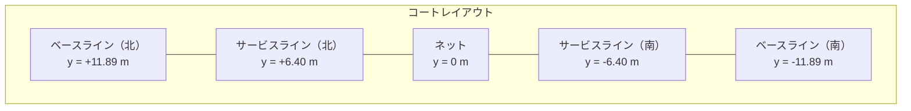

## はじめに — あの時間、最適化できないだろうか

テニススクールに通ったことがある人なら、誰もが経験したことがあるだろう。

球出し練習が終わると、コーチの「じゃあ拾って〜」の一声で、コートには200個近いボールが散らばっている。生徒6人がそれぞれのやり方でボールを拾い始める。ある人はラケットにボールを山積みにしてからカゴへ運ぶ。ある人はしゃがんでカゴを持ちながら黙々と拾い続ける。ある人はラケットでボールをフェンス際に打ち飛ばし、あとでまとめて回収する。

この何気ない光景を眺めていて、ふと思った。

**「いま自分たちがやっているこの拾い方は、果たして最適なのか？」**

正直に言おう。私はいつもしゃがみ移動でカゴを持ちながら黙々とボールを拾っている側の人間だ。正直しんどい。一方で、ラケットでボールをパカパカ打ち飛ばすばかりで全然ボールをカゴに入れない人がいる。「あの人サボってるな」と思いたい。思いたいのだが——もしかしたら、遠くに散らばったボールをまず打ち飛ばして一箇所に集約してから拾う方が、全体としては効率的なのではないか？ その疑念が、どうしても払拭できない。

**「怠けているように見える打ち飛ばし勢は、実は最適解に近いのかもしれない」**——この問いに数理的に決着をつけたい。それがこの連載の出発点だ。

一見すると単純なボール拾いだが、よく考えるとこの問題は奥が深い。巡回セールスマン問題（TSP）のような経路最適化の側面を持ちながら、拾い方スタイルという複数の戦略選択があり、さらにカゴの配置やボールの偏り方まで絡んでくる。

本連載では、テニスの球出し練習後のボール拾いを数理最適化の問題として真剣に定式化し、シミュレーションで解析する。前半（#1〜#4）ではエネルギー論に基づく数理最適解を導き、後半（#5〜#6）では強化学習エージェントによる「最強球拾いチーム」の編成に挑む。

:::message
本記事は連載第1回です。今回は問題の全体像を描き、モデル化の基盤を固めます。
:::

---

## この問題が面白い理由

ボール拾いを最適化問題として見ると、以下のような構造が浮かび上がる。

### TSP的な経路最適化

$N$ 個のボールをすべて回収しカゴに戻すという基本構造は、**巡回セールスマン問題（TSP）**と本質的に同じだ。ただし、途中でカゴに戻って荷下ろしする必要があるため、容量制約付き配送計画問題（CVRP）に近い。

### カゴの配置最適化

現実のテニススクールでは、コート上に**4つのカゴ**を配置する。このカゴをどこに置くかで、ボールの回収効率は劇的に変わる。カゴ配置の最適化は、k-mediansクラスタリング問題に帰着する。

### 複数の戦略（拾い方スタイル）

同じボール配置に対しても、使うスタイルによって必要な移動距離・エネルギー・時間が大きく異なる。特に、しゃがんでカゴを持ちながら拾う「カゴ持ち巡回」と、打ち飛ばして集約する「ラケット打ち飛ばし」のどちらが効率的かという問いは、**打ち飛ばし比率**という連続パラメータの最適化問題に発展する。

### 時間効率 vs エネルギー効率のトレードオフ

速く拾える方法が必ずしも楽とは限らない。走り回れば速いがエネルギーを消耗し、ゆっくり運べば楽だが時間がかかる。この**多目的最適化**の構造がある。

### 協調戦略

複数人で拾う場合、各自の担当領域をどう分割するか、同じエリアに群がって非効率にならないか——チーム全体の効率を最大化する**協調最適化**の問題が生じる。

---

## コートジオメトリの定義

まず「舞台」を定義しよう。ITF（国際テニス連盟）の公式規格に基づくダブルスコートを基準とする。

### パラメータ

| 記号 | 意味 | 値 |
|------|------|-----|
| $L$ | コート全長 | 23.77 m |
| $W_d$ | ダブルスコート幅 | 10.97 m |
| $W_s$ | シングルスコート幅 | 8.23 m |
| $d_{sv}$ | ネット〜サービスライン距離 | 6.40 m |
| $d_{back}$ | ベースライン後方スペース | 6.40 m |
| $d_{side}$ | サイドライン外側スペース | 3.66 m |

### 座標系

コート中央（ネット中央）を原点 $(0, 0)$ とする座標系を採用する。

- **$x$ 軸**: サイドライン方向（コート幅方向）
- **$y$ 軸**: ベースライン方向（コート長さ方向）



### 有効領域

ボールが散在しうる範囲は、コート本体にバックスペースとサイドスペースを加えた矩形領域である。

$$A_{total} = (L + 2 d_{back}) \times (W_d + 2 d_{side}) \approx 36.57 \times 18.29 \approx 669 \text{ m}^2$$

この約 $669 \text{ m}^2$ が、ボール拾いの「戦場」となる。

### 実装

```python
from dataclasses import dataclass
import numpy as np

@dataclass(frozen=True)
class CourtGeometry:
    """ITF公式規格に基づくテニスコートの幾何学パラメータ."""
    court_length: float = 23.77   # L: コート全長 [m]
    doubles_width: float = 10.97  # W_d: ダブルスコート幅 [m]
    singles_width: float = 8.23   # W_s: シングルスコート幅 [m]
    service_line_dist: float = 6.40  # d_sv: ネット〜サービスライン [m]
    back_space: float = 6.40      # d_back: ベースライン後方 [m]
    side_space: float = 3.66      # d_side: サイドライン外側 [m]

    @property
    def total_area(self) -> float:
        """有効領域面積 [m^2]."""
        total_length = self.court_length + 2 * self.back_space
        total_width = self.doubles_width + 2 * self.side_space
        return total_length * total_width
```

---

## ボール分布モデル — ボールはどこに溜まるのか

球出し練習が終わったとき、ボールはコート全体に均一に散らばっているわけではない。練習内容に応じた明確な偏りがある。しかも、**テニスボールはコート枠で勝手に停止しない**。ここを正しくモデル化しなければ、シミュレーションは現実と乖離する。

### クロス・ダウンザライン分布

球出し練習では、コーチがクロスまたはダウンザラインに配球し、生徒がそれぞれの方向に打ち返す。返球はコート後方かつ角（コーナー）に向かいやすい。また、ネットにかかったミスショットはネット手前に落ちる。

この返球方向を**着地位置の分布**として、6ゾーンのガウス混合モデル（GMM）で表現する。

| ゾーン | 領域 | ボール割合 | 物理的理由 |
|--------|------|-----------|-----------|
| クロスコーナー（左） | 北側ベースライン左角 ±3m | 25% | クロスラリーの集約点 |
| クロスコーナー（右） | 北側ベースライン右角 ±3m | 25% | クロスラリーの集約点 |
| DTLコーナー（左） | 北側左端 ±2m | 10% | ストレートの集約点 |
| DTLコーナー（右） | 北側右端 ±2m | 10% | ストレートの集約点 |
| ネットミス帯 | ネット手前（南側）±2m | 20% | ネットにかかった球 |
| バックフェンス帯 | 北側後方スペース | 10% | 深すぎた球のオーバー |

### テニスボールの物理 — 着地してからが本番

ここからが、紙面上のモデルと実際のテニスコートが大きく食い違うポイントだ。

上のGMMはあくまで**着地位置**を表している。しかし実際のテニスボールは、ベースライン付近に着地した後もバウンドし、転がり続ける。コート枠の白線に沿って行儀よく停止してくれるわけがない。

バウンド後のボールは打球方向——おおむね北側（バックフェンス方向）——に転がっていく。行き着く先はバックフェンスだ。フェンスに当たったボールは、跳ね返って1〜2m手前で停止するか、フェンス際にそのまま溜まる。つまり、**ボールの最終静止位置はバックフェンス際に偏る**。

ネットにかかったミスショットだけは事情が異なる。ネットに当たって手前に落ちたボールは、もう勢いがない。南側のコート上で、落ちた場所からほとんど動かない。

この「着地してから停止するまで」の物理を、シミュレーションでは**転がりモデル**として実装する。

$$\mathbf{x}_{rest} = \mathbf{x}_{land} + d_{roll} \cdot \hat{\mathbf{v}} + \mathbf{\epsilon}_{fence}$$

- $\mathbf{x}_{land}$: GMM からサンプリングした着地位置
- $d_{roll}$: 転がり距離（指数分布、通常球: 平均3m / ネットミス球: 平均1m）
- $\hat{\mathbf{v}}$: 打球方向の単位ベクトル（おおよそネットから着地点への方向）
- $\mathbf{\epsilon}_{fence}$: フェンス跳ね返り補正（フェンスを越えた分だけ跳ね返る）

**結果として、GMMの着地分布に比べて最終静止分布はバックフェンス際に集中する。** この偏りがカゴ配置の最適化に大きく影響する。

### ガウス混合モデル（GMM）による定式化

各ゾーン内のボール着地分布を2次元正規分布で近似し、全体をガウス混合モデルとして表現する。

$$p(\mathbf{x}_{land}) = \sum_{k=1}^{K} w_k \cdot \mathcal{N}(\mathbf{x}_{land} \mid \boldsymbol{\mu}_k, \boldsymbol{\Sigma}_k)$$

ここで:
- $K = 6$: ゾーン数
- $w_k$: 第 $k$ ゾーンの重み（$\sum_k w_k = 1$）
- $\boldsymbol{\mu}_k$: 第 $k$ ゾーンの中心座標
- $\boldsymbol{\Sigma}_k$: 第 $k$ ゾーンの分散共分散行列

クロスコーナーの分散共分散行列には非対角成分を含め、ショットの方向性による**x-y方向の相関**をモデル化している。

### 実装

```python
def create_cross_dtl_distribution(court: CourtGeometry) -> BallDistribution:
    """クロス・ダウンザライン分布モデル（着地位置GMM）."""
    hl = court.half_length
    hw_s = court.singles_width / 2

    zones = [
        BallZone(name="クロスコーナー（左）", weight=0.25,
                 mu=np.array([-hw_s + 1.0, hl - 1.0]),
                 sigma=np.array([[2.5, 0.3], [0.3, 2.0]])),
        BallZone(name="クロスコーナー（右）", weight=0.25,
                 mu=np.array([hw_s - 1.0, hl - 1.0]),
                 sigma=np.array([[2.5, -0.3], [-0.3, 2.0]])),
        # DTLコーナー、ネットミス帯、バックフェンス帯...
    ]
    return BallDistribution(name="クロス・ダウンザライン", zones=zones)


# 着地位置をサンプリングし、転がりを適用して最終静止位置を得る
landing = distribution.sample(200, court, rng)
resting = apply_ball_rolling(landing, court, rng)
```

この2段階のパイプライン——**GMM着地 → 転がり補正**——により、バックフェンス際へのボール集中という現実の分布を再現する。

---

## カゴとカートの運用モデル

### なぜ4カゴなのか

実際のテニススクールでは、球出し練習でカゴ4つと中央カートを使用する。球出し用にカゴ4つ分のボール（約200球）を使い、練習後にそれをすべて回収する。

| パラメータ | 値 | 備考 |
|-----------|-----|------|
| カゴ数 $K$ | 4 | 配置自由（最適化変数） |
| カゴ容量 $C_{basket}$ | 50 球/カゴ | 4カゴ合計200球 |
| カート | 車輪付き・移動可能 | いっぱいのカゴの戻し先 |
| カゴ搬送時間 $t_{return}$ | 10 秒/回 | カゴをカートまで運んで載せる時間 |

### カゴは「移動可能」、カートも「移動可能」

ここで重要なのは、カゴもカートも固定されたインフラではなく**移動可能な拠点**だということだ。

カゴはボール拾いを始める前にコート上の「良い場所」に配置できる。この配置次第で、ボールからカゴまでの移動距離が大きく変わる。カートも車輪付きなので、最適な位置に停めておける。

### カゴの使い捨てモデル

現実のカゴ運用を正確にモデル化すると、以下のフローになる。

1. ボール拾いの前に、4つのカゴをコート上に配置する
2. 各自が最寄りのカゴにボールを投入する
3. **カゴが50球に達したら、カゴごとカートに載せて戻す**
4. **ボールはカゴから空にしない。カゴがそのままカートに乗る**
5. **空きカゴが1つ減る。** カゴ4 → 3 → 2 → 1 → 0

ここがよくある数理モデルと現実が異なるポイントだ。多くのCVRPモデルでは「デポに戻ったら荷物を下ろして再出発」を仮定するが、テニスのカゴ運用では**カゴは再利用されない**。いっぱいになったカゴはカートに載せて終わり。200球を4カゴで過不足なく回収するためには、カゴ間のボール割り当てを適切に行う必要がある——特定のカゴに50球以上が集中しないように。

### 配置の最適化問題

カゴの配置は次の最適化問題として定式化できる。

$$\min_{\{p_k\}_{k=1}^{K}} \sum_{i=1}^{N} \min_{k} \| b_i - p_k \|$$

各ボール $b_i$ から最近傍のカゴ $p_k$ までの距離の総和を最小化する。これは**k-mediansクラスタリング問題**に帰着する。ただし、各クラスタのサイズが $C_{basket}$ を超えないという容量制約が加わる。

シミュレーションでは、k-means++初期化 + 中央値更新の反復アルゴリズムで最適配置を求め、その後に容量制約付き割り当てで各カゴに最大50球を振り分ける。

```python
@dataclass(frozen=True)
class BasketConfig:
    """カゴ・カートの構成パラメータ."""
    n_baskets: int = 4
    basket_capacity: int = 50
    dump_time: float = 10.0  # カゴ→カート搬送時間 [秒]
```

---

## 拾い方スタイルの定式化

テニススクールで観察される主要な4つの拾い方スタイルを定式化する。

### Style A: ラケット載せ運搬

ラケット面にボールを山積みにしてカゴまで運搬するスタイル。慣れた人なら**一度に約20球**を載せて運べる。ただし、ボールの山が大きくなるほど不安定になり、急ぐと崩れて落ちるため、運搬時は慎重に歩く必要がある。**体感では最も遅いスタイル。**

| パラメータ | 記号 | 値 |
|-----------|------|-----|
| 最大積載数 | $C_A$ | 20 球 |
| 運搬時歩行速度 | $v_{carry}$ | 0.7 m/s（満載時は更に低下） |
| 拾い上げ時間 | $t_{pick}$ | 2.0 秒/球 |
| 速度低下係数 | $\gamma_A$ | 0.02 /球 |

積載数に応じた速度低下は:

$$v(k) = v_{carry} \cdot (1 - \gamma_A \cdot k)$$

20球を満載したとき $v(20) = 0.7 \times (1 - 0.02 \times 20) = 0.42$ m/s。ほとんど匍匐前進のような速度だ。

**行動パターン**: 拾う → 載せる → （$C_A$ 球まで繰り返し） → カゴへ慎重に移動 → 投入 → 次エリア

### Style B: しゃがみ移動・カゴ持ち

**しゃがんだ状態でカゴを持ちながら移動し、両手でボールを拾ってすぐカゴに入れる。** これが実際のスクールで最も一般的なスタイルだ。

両手で2〜3個/秒のペースでカゴに投入でき、拾い上げから投入までの遷移コストがほぼゼロ。ただし移動速度はしゃがみ姿勢のため遅くなる。

| パラメータ | 記号 | 値 |
|-----------|------|-----|
| カゴ容量 | $C_B$ | 50 球（カゴ1つ分） |
| 移動速度（しゃがみ） | $v_{squat}$ | 0.7 m/s |
| 拾い上げ時間 | $t_{pick}$ | 0.4 秒/球 |
| 速度低下係数 | $\gamma_B$ | 0.005 /球 |

**行動パターン**: しゃがみ移動 → 両手で拾う → 即カゴ投入 → 移動 → （$C_B$ 球まで繰り返し） → カゴごとカートに載せて戻し

**Style B の最大の強み**は、カゴを手元に持っていることで**往復回数が激減する**点にある。Style Aが20球ごとにカゴまで歩かなければならないのに対し、Style Bはカゴ1つ分の50球を連続で拾い続けられる。4カゴ体制なら200球を4回のカート戻しだけで完了できる。

### Style C: ラケット打ち飛ばし集約（特殊型）

ラケットで足元のボールをすくい、目標方向に飛ばして一箇所に集約するスタイル。**二段階構造が独特**であり、他スタイルとは本質的に異なる。

| パラメータ | 記号 | 値 |
|-----------|------|-----|
| スイング時間 | $t_{swing}$ | 1.0 秒/スイング |
| スクープ半径 | $r_{scoop}$ | 1.0 m |
| 最大球数/スイング | $n_{scoop}$ | 4 球（密集地帯） |
| 着地点ばらつき | $\sigma_{hit}$ | 3 m（標準偏差） |
| 集約後の回収 | — | Style A または Style B で回収 |

打ち飛ばしの速度はボール密度に強く依存する。密集地帯ではひと掬いで3〜4球を一度に飛ばせる（実効 $\approx 0.25$ 秒/球）が、過疎地帯では1球ずつ打つしかない（実効 $1.0$ 秒/球）。

**行動パターン**:
- **Phase 1（集約）**: 散在するボールを次々に打ち飛ばして集約点付近に集める。しゃがむ必要がないため屈伸コストが低い。密集地帯では1スイングで複数球を飛ばせる。
- **Phase 2（回収）**: 集約点からまとめて運搬。**打ち飛ばしたボールは勝手にカゴに入るわけではなく、最終的に手やラケットで拾う必要がある。**

#### 打ち飛ばし比率 $\alpha$ — この連載の核心的問い

全 $N$ 球のうち比率 $\alpha$ を打ち飛ばし、残り $(1-\alpha)$ を直接拾う**混合戦略**を考える。

$$T_{mixed}(\alpha) = T_{C,phase1}(\alpha N) + T_{C,phase2}(\alpha N) + T_{B}((1-\alpha) N)$$

$\alpha = 0$ なら全部を直接Style Bで拾い、$\alpha = 1$ なら全部を打ち飛ばしてから拾う。最適な $\alpha^*$ はボール分布・カゴ配置・Phase 2の回収スタイルに依存する。

$$\alpha^* = \arg\min_{\alpha \in [0,1]} T_{mixed}(\alpha)$$

**遠方に散らばったボールは打ち飛ばしで集約し、カゴ近くのボールは直接拾う**——この直観は正しいのか？ 数値シミュレーションが答えを出す。

### Style D: ホッパー巡回

ホッパー（テニスボール回収器具）を地面に押し付けて回収しながら歩き回るスタイル。

| パラメータ | 記号 | 値 |
|-----------|------|-----|
| 回収速度 | $t_{hopper}$ | 1.5 秒/球 |
| 移動速度 | $v_{hopper}$ | 1.0 m/s |
| ホッパー容量 | $C_D$ | 72 球 |
| 屈伸 | — | 不要 |

**特徴**: 屈伸が不要なためエネルギー効率が極めて高い。大容量なのでカゴへの往復も少ない。ただし、ホッパーを設置しているスクールは少ない。

---

## 4つのスタイルの比較

各スタイルの性質を直観的に整理しておこう。

| 特性 | Style A | Style B | Style C | Style D |
|------|---------|---------|---------|---------|
| 移動速度 | 遅い（0.7 m/s） | 遅い（0.7 m/s） | 普通（1.3 m/s） | やや遅い（1.0 m/s） |
| 1回の積載量 | 20球 | 50球（カゴ1つ分） | 可変 | 72球 |
| 拾い時間 | 2.0 秒/球 | 0.4 秒/球 | 2.5 秒/球（Phase 1） | 1.5 秒/球 |
| 屈伸コスト | 高い | 高い | Phase 1: なし / Phase 2: 高い | なし |
| カゴ往復頻度 | 中（20球ごと） | 低（50球ごと） | 低 | 低（72球ごと） |

注目すべきは**Style Bの拾い時間の圧倒的な速さ（0.4秒/球）**だ。両手で拾って即座にカゴに投入できるため、1球あたりの処理時間がStyle A（2.0秒）の1/5になる。ただし、しゃがみ姿勢での移動は身体に負荷がかかる。

体感での速度序列は:

$$\text{C+B混合} > \text{B単独} > \text{A}$$

打ち飛ばし後にしゃがみ拾いする混合戦略が最速という体感は、果たして数理的に正当化されるのか？

---

## 次回予告 — エネルギーの物理学

ここまでで、ボール拾い問題の「舞台」（コートジオメトリ）、「登場人物」（ボール分布と転がり物理）、「拠点」（4カゴ + 移動カート）、「武器」（拾い方スタイル）を定義した。

しかし、最適化を語るには**目的関数**が必要だ。「何を最小化するのか？」——その答えの一つがエネルギーである。

次回の記事では、歩行・屈伸・運搬それぞれのエネルギーコストを物理学に基づいて定式化する。累積疲労モデルも導入し、「同じ動作でも繰り返すほど辛くなる」という人間の身体的制約を取り込む。

$$E_{total} = E_{walk} + E_{bend} + E_{carry}$$

200回の屈伸の最初と最後では、1回あたりのコストが異なる。この非線形性が、最適解を単純なTSPとは異なるものにする。

:::message
本連載のシミュレーションコードは [GitHub リポジトリ](https://github.com/gyp0bt/zenn-article/tree/main/simulations/tennis_ball_picking) で公開しています。
:::

---

## まとめ

本記事では、テニススクールのボール拾いを数理最適化問題としてモデル化するための基盤を構築した。

1. **コートジオメトリ**: ITF公式規格に基づく669 m²の有効領域を定義
2. **ボール分布**: クロス・ダウンザラインの6ゾーンGMM + 転がり物理モデル（着地後にバックフェンスまで転がり、跳ね返る挙動を再現）
3. **カゴ・カート運用**: 4カゴ × 50球 + 移動式カート。カゴは使い捨て（満杯カゴをカートに載せ、空きカゴが減る）。配置はk-medians最適化
4. **拾い方スタイル**: ラケット載せ（A, 20球）、しゃがみ移動カゴ持ち（B）、打ち飛ばし集約（C）、ホッパー巡回（D）の4スタイルを定式化
5. **打ち飛ばし比率 $\alpha$**: C+B混合戦略の最適化という核心的問いを提示

次回はエネルギーモデルを構築し、「最も効率的な拾い方」の定量的な議論に踏み込む。
