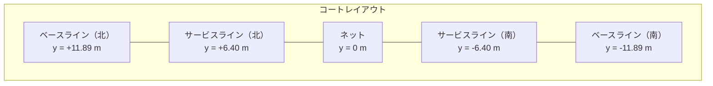

## はじめに — あの時間、最適化できないだろうか

テニススクールに通ったことがある人なら、誰もが経験したことがあるだろう。

球出し練習が終わると、コーチの「じゃあ拾って〜」の一声で、コートには100個近いボールが散らばっている。生徒6人がそれぞれのやり方でボールを拾い始める。ある人はラケットにボールを山積みにしてからカゴへ運ぶ。ある人は1球ずつ手で拾ってはカゴへ走る。ある人はラケットでボールをフェンス際に打ち飛ばし、あとでまとめて回収する。

この何気ない光景を眺めていて、ふと思った。

**「いま自分たちがやっているこの拾い方は、果たして最適なのか？」**

一見すると単純なボール拾いだが、よく考えるとこの問題は奥が深い。巡回セールスマン問題（TSP）のような経路最適化の側面を持ちながら、拾い方スタイルという複数の戦略選択があり、さらに人間の身体エネルギーという物理的制約まで絡んでくる。

本連載では、テニスの球出し練習後のボール拾いを数理最適化の問題として真剣に定式化し、シミュレーションで解析する。前半（#1〜#4）ではエネルギー論に基づく数理最適解を導き、後半（#5〜#6）では強化学習エージェントによる「最強球拾いチーム」の編成に挑む。

:::message
本記事は連載第1回です。今回は問題の全体像を描き、モデル化の基盤を固めます。
:::

---

## この問題が面白い理由

ボール拾いを最適化問題として見ると、以下のような構造が浮かび上がる。

### TSP的な経路最適化

$N$ 個のボールをすべて回収しカゴに戻すという基本構造は、**巡回セールスマン問題（TSP）**と本質的に同じだ。ただし、途中でカゴに戻って荷下ろしする必要があるため、容量制約付き配送計画問題（CVRP）に近い。

### 複数の戦略（拾い方スタイル）

同じボール配置に対しても、使うスタイルによって必要な移動距離・エネルギー・時間が大きく異なる。これは**戦略選択**の次元が加わることを意味する。

### 時間効率 vs エネルギー効率のトレードオフ

速く拾える方法が必ずしも楽とは限らない。走り回れば速いがエネルギーを消耗し、ゆっくり運べば楽だが時間がかかる。この**多目的最適化**の構造がある。

### 協調戦略

複数人で拾う場合、各自の担当領域をどう分割するか、同じエリアに群がって非効率にならないか——チーム全体の効率を最大化する**協調最適化**の問題が生じる。

---

## コートジオメトリの定義

まず「舞台」を定義しよう。ITF（国際テニス連盟）の公式規格に基づくダブルスコートを基準とする。

### パラメータ

| 記号 | 意味 | 値 |
|------|------|-----|
| $L$ | コート全長 | 23.77 m |
| $W_d$ | ダブルスコート幅 | 10.97 m |
| $W_s$ | シングルスコート幅 | 8.23 m |
| $d_{sv}$ | ネット〜サービスライン距離 | 6.40 m |
| $d_{back}$ | ベースライン後方スペース | 6.40 m |
| $d_{side}$ | サイドライン外側スペース | 3.66 m |

### 座標系

コート中央（ネット中央）を原点 $(0, 0)$ とする座標系を採用する。

- **$x$ 軸**: サイドライン方向（コート幅方向）
- **$y$ 軸**: ベースライン方向（コート長さ方向）



### 有効領域

ボールが散在しうる範囲は、コート本体にバックスペースとサイドスペースを加えた矩形領域である。

$$A_{total} = (L + 2 d_{back}) \times (W_d + 2 d_{side}) \approx 36.57 \times 18.29 \approx 669 \text{ m}^2$$

この約 $669 \text{ m}^2$ が、ボール拾いの「戦場」となる。

### 実装

```python
from dataclasses import dataclass
import numpy as np

@dataclass(frozen=True)
class CourtGeometry:
    """ITF公式規格に基づくテニスコートの幾何学パラメータ."""
    court_length: float = 23.77   # L: コート全長 [m]
    doubles_width: float = 10.97  # W_d: ダブルスコート幅 [m]
    singles_width: float = 8.23   # W_s: シングルスコート幅 [m]
    service_line_dist: float = 6.40  # d_sv: ネット〜サービスライン [m]
    back_space: float = 6.40      # d_back: ベースライン後方 [m]
    side_space: float = 3.66      # d_side: サイドライン外側 [m]

    @property
    def total_area(self) -> float:
        """有効領域面積 [m^2]."""
        total_length = self.court_length + 2 * self.back_space
        total_width = self.doubles_width + 2 * self.side_space
        return total_length * total_width
```

---

## ボール分布モデル — どこにボールは落ちるのか

球出し練習が終わったとき、ボールはコート全体に均一に散らばっているわけではない。練習内容に応じた偏りがある。この偏りを確率密度関数としてモデル化する。

### ストローク練習モデル（基本モデル）

最も典型的なシナリオとして、コーチが片側（南側）から球出しし、生徒が対面コート（北側）に打ち返すストローク練習を考える。

ボールの着地点は以下のゾーンに分類できる。

| ゾーン | 領域 | ボール割合 | 物理的理由 |
|--------|------|-----------|-----------|
| ベースライン帯 | 北側ベースライン ±3 m | 60% | ストロークの主なターゲットゾーン |
| ネット帯 | ネット ±2 m | 15% | ネットに引っかけたミスショット |
| サイド帯 | サイドライン外 | 15% | サイドアウトしたショット |
| バックフェンス帯 | 北側後方スペース | 10% | 深すぎたショット、フェンスに跳ね返り |

### ガウス混合モデル（GMM）による定式化

各ゾーン内のボール分布を2次元正規分布で近似し、全体をガウス混合モデルとして表現する。

$$p(\mathbf{x}) = \sum_{k=1}^{K} w_k \cdot \mathcal{N}(\mathbf{x} \mid \boldsymbol{\mu}_k, \boldsymbol{\Sigma}_k)$$

ここで:
- $K$: ゾーン数
- $w_k$: 第 $k$ ゾーンの重み（$\sum_k w_k = 1$）
- $\boldsymbol{\mu}_k$: 第 $k$ ゾーンの中心座標
- $\boldsymbol{\Sigma}_k$: 第 $k$ ゾーンの分散共分散行列

### 各ゾーンのパラメータ

| ゾーン | $w_k$ | $\boldsymbol{\mu}_k$ | $\boldsymbol{\Sigma}_k$ |
|--------|-------|------|------|
| ベースライン帯 | 0.60 | $(0, 11.89)$ | $\mathrm{diag}(6.0, 3.0)$ |
| ネット帯 | 0.15 | $(0, 0)$ | $\mathrm{diag}(8.0, 1.5)$ |
| サイド帯（左） | 0.075 | $(-6.49, 3.57)$ | $\mathrm{diag}(1.5, 15.0)$ |
| サイド帯（右） | 0.075 | $(6.49, 3.57)$ | $\mathrm{diag}(1.5, 15.0)$ |
| バックフェンス帯 | 0.10 | $(0, 15.73)$ | $\mathrm{diag}(5.0, 2.0)$ |

:::message
分散共分散行列は対角行列（$\mathrm{diag}$）を仮定している。つまりx方向とy方向の散らばりは独立としている。実際にはクロスショットの方向性などで相関が出るが、第一近似としては十分である。
:::

### 実装

```python
def create_stroke_distribution(court: CourtGeometry) -> BallDistribution:
    """ストローク練習モデル（基本モデル）を生成."""
    hl = court.half_length
    zones = [
        BallZone(name="ベースライン帯", weight=0.60,
                 mu=np.array([0.0, hl]),
                 sigma=np.array([[6.0, 0.0], [0.0, 3.0]])),
        BallZone(name="ネット帯", weight=0.15,
                 mu=np.array([0.0, 0.0]),
                 sigma=np.array([[8.0, 0.0], [0.0, 1.5]])),
        # ... (左右サイド帯、バックフェンス帯)
    ]
    return BallDistribution(name="ストローク練習", zones=zones)
```

有効領域外のサンプルは棄却再サンプリングで処理する。つまり、フェンスの外に飛んでいったボールは「存在しないもの」として扱う。

---

## 拾い方スタイルの定式化

テニススクールで観察される主要な4つの拾い方スタイルを定式化する。それぞれ特有のパラメータを持ち、時間効率とエネルギー効率に異なるトレードオフがある。

### Style A: ラケット載せ運搬

ラケット面にボールを載せ、ある程度溜まったらカゴまで運搬するスタイル。

| パラメータ | 記号 | 値 |
|-----------|------|-----|
| 最大積載数 | $C_A$ | 5〜6 球 |
| 運搬時歩行速度 | $v_{carry}$ | 0.9 m/s |
| 拾い上げ時間 | $t_{pick}$ | 2.0 秒/球 |

**行動パターン**: 拾う → 載せる → （$C_A$ 球まで繰り返し） → カゴへ移動 → 投入 → 次エリア

**特徴**: カゴへの往復回数が少なくて済むが、バランスを取りながらの移動で速度が低下する。ボールが多い密集地帯で威力を発揮する。

### Style B: 手拾い直行

手でボールを拾い、直接カゴへ運ぶ最もシンプルなスタイル。

| パラメータ | 記号 | 値 |
|-----------|------|-----|
| 最大保持数 | $C_B$ | 3 球（片手） |
| 移動速度 | $v_{walk}$ | 1.3 m/s |
| 拾い上げ時間 | $t_{pick}$ | 2.0 秒/球 |

**特徴**: 移動速度は速いが、保持数が少ないためカゴへの往復回数が多い。ボールが散在している状況で相対的に有利。

### Style C: ラケット打ち飛ばし集約

ラケットで足元のボールをすくい、フェンス方向に飛ばして一箇所に集約してから一括回収するスタイル。

| パラメータ | 記号 | 値 |
|-----------|------|-----|
| 打ち飛ばし時間 | $t_{hit}$ | 2.5 秒/球 |
| 着地点ばらつき | $\sigma_{hit}$ | 3 m（標準偏差） |
| 集約後の回収 | — | Style B と同等 |

**行動パターン**:
- **Phase 1（集約）**: 散在するボールを次々に打ち飛ばして集約点付近に集める
- **Phase 2（回収）**: 集約点からまとめて運搬

**特徴**: 二段階構造が独特。Phase 1ではしゃがむ必要がないため屈伸コストが低い。ただし打ち飛ばしの精度（$\sigma_{hit}$）が大きいと、Phase 2で広範囲を歩く必要がある。

### Style D: ホッパー巡回

ホッパー（テニスボール回収器具）を地面に押し付けて回収しながら歩き回るスタイル。

| パラメータ | 記号 | 値 |
|-----------|------|-----|
| 回収速度 | $t_{hopper}$ | 1.5 秒/球 |
| 移動速度 | $v_{hopper}$ | 1.0 m/s |
| ホッパー容量 | $C_D$ | 72 球 |
| 屈伸 | — | 不要 |

**特徴**: 屈伸が不要なためエネルギー効率が極めて高い。大容量なのでカゴへの往復も少ない。ただし、ホッパーを押しながらの移動速度はやや遅く、ボールが少ない広いエリアでは移動コストが支配的になる。

---

## 4つのスタイルの比較

ここで、各スタイルの性質を直観的に整理しておこう。

| 特性 | Style A | Style B | Style C | Style D |
|------|---------|---------|---------|---------|
| 移動速度 | 遅い | 速い | 普通 | やや遅い |
| 積載量 | 中（5-6） | 少（3） | 可変 | 大（72） |
| 屈伸コスト | 高い | 高い | Phase 1: なし / Phase 2: 高い | なし |
| カゴ往復頻度 | 中 | 高 | 低 | 低 |
| 密集地帯向き | ◎ | △ | ○ | ◎ |
| 散在地帯向き | △ | ○ | △ | ○ |

直観的に、ボールが密集している場合はStyle AやDが有利で、広く散らばっている場合はStyle Bの機動性が活きそうだ。Style Cは集約フェーズの精度が鍵を握る。

しかし、直観だけでは「どのスタイルが最適か」は判断できない。なぜなら、最適解はボール配置、プレイヤーの体力、人数、コートの状況など多くの変数に依存するからだ。

---

## 次回予告 — エネルギーの物理学

ここまでで、ボール拾い問題の「舞台」（コートジオメトリ）、「登場人物」（ボール分布）、「武器」（拾い方スタイル）を定義した。

しかし、最適化を語るには**目的関数**が必要だ。「何を最小化するのか？」——その答えの一つがエネルギーである。

次回の記事では、歩行・屈伸・運搬それぞれのエネルギーコストを物理学に基づいて定式化する。累積疲労モデルも導入し、「同じ動作でも繰り返すほど辛くなる」という人間の身体的制約を取り込む。

$$E_{total} = E_{walk} + E_{bend} + E_{carry}$$

100回の屈伸の最初と最後では、1回あたりのコストが異なる。この非線形性が、最適解を単純なTSPとは異なるものにする。

:::message
本連載のシミュレーションコードは [GitHub リポジトリ](https://github.com/gyp0bt/zenn-article/tree/main/simulations/tennis_ball_picking) で公開しています。
:::

---

## まとめ

本記事では、テニススクールのボール拾いを数理最適化問題としてモデル化するための基盤を構築した。

1. **コートジオメトリ**: ITF公式規格に基づく669 m²の有効領域を定義
2. **ボール分布**: ストローク練習を想定したガウス混合モデル（5ゾーン）
3. **拾い方スタイル**: ラケット載せ（A）、手拾い（B）、打ち飛ばし集約（C）、ホッパー巡回（D）の4スタイルを定式化

次回はエネルギーモデルを構築し、「最も効率的な拾い方」の定量的な議論に踏み込む。
