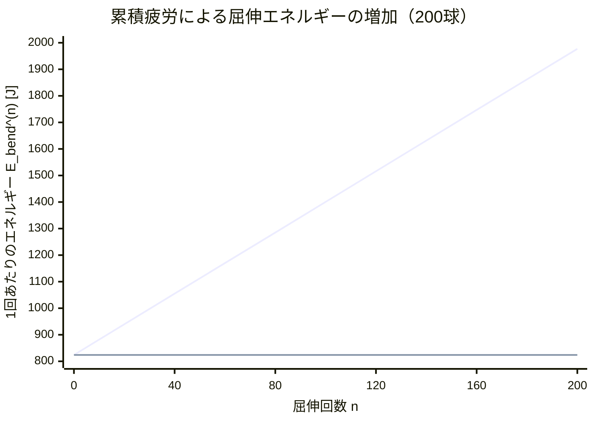

## はじめに — なぜエネルギーを考えるのか

[前回の記事](https://zenn.dev/gyp0bt/articles/tennis-ball-picking-1-modeling)では、テニスのボール拾いを数理最適化問題としてモデル化するための基盤を構築した。コートの幾何学、クロスDTL分布、4カゴ体制、4つの拾い方スタイルを定義した。

しかし、**最適化には目的関数が必要だ**。何を最小化するのか？

候補は2つある。**時間**と**エネルギー**だ。

時間最小化は分かりやすい。「なるべく速く拾い終わりたい」——これはTSP（巡回セールスマン問題）の典型的な目的関数に対応する。だが、テニスのボール拾いには見落とせないもう一つの軸がある。

**身体的な疲労だ。**

200個のボールを拾い終えたとき、身体が感じる「だるさ」は拾い方によって大きく異なる。しゃがみ姿勢でカゴを持ちながら200回も拾うのと、ホッパーを押して歩くのとでは、消費エネルギーが桁違いに異なるはずだ。しかも、同じ屈伸動作でも1回目と150回目では辛さが違う——累積疲労という非線形性がある。

本記事では、ボール拾いの3つのエネルギーコスト要素（歩行・屈伸・運搬）を物理学に基づいて定式化する。

$$E_{total} = E_{walk} + E_{bend} + E_{carry}$$

:::message
本記事は連載第2回です。[第1回（問題設定とモデル化）](https://zenn.dev/gyp0bt/articles/tennis-ball-picking-1-modeling)を先にお読みください。
:::

---

## 歩行のエネルギーコスト

### 歩行の基本モデル

人間の歩行にはエネルギーが必要だ。生体力学の研究によれば、歩行のエネルギーコストは体重・距離・速度の関数として表現できる。

$$E_{walk}(d, v) = c_{walk}(v) \cdot m \cdot d$$

ここで:
- $d$: 移動距離 [m]
- $v$: 歩行速度 [m/s]
- $m$: 体重 [kg]
- $c_{walk}(v)$: 速度依存の歩行コスト係数 [J/(kg·m)]

### 速度依存コスト係数

歩行コスト係数 $c_{walk}(v)$ は速度の2次関数でモデル化する。

$$c_{walk}(v) = \alpha_0 + \alpha_1 v + \alpha_2 v^2$$

| 係数 | 意味 | 値 |
|------|------|-----|
| $\alpha_0$ | 基礎代謝的コスト | 1.5 J/(kg·m) |
| $\alpha_1$ | 速度比例コスト | 0.8 J·s/(kg·m²) |
| $\alpha_2$ | 速度2乗コスト（慣性・空気抵抗） | 0.3 J·s²/(kg·m³) |

この関数の形状は、**ゆっくり歩くほどコスト係数は低いが、移動に時間がかかる**というトレードオフを表現している。速く歩くと加速・減速の繰り返しや姿勢制御のエネルギーが増大し、コスト係数が上昇する。

典型的な歩行速度でのコスト係数を計算してみよう。

| 速度 [m/s] | スタイル | $c_{walk}$ [J/(kg·m)] | 60kgの人が10m歩くエネルギー [J] |
|---|---|---|---|
| 0.7（しゃがみ移動 / ラケット載せ） | Style A, B | 2.21 | 1,326 |
| 1.0（ホッパー） | Style D | 2.60 | 1,560 |
| 1.3（通常歩行 / 打ち飛ばし移動） | Style C | 3.05 | 1,827 |

:::message
実際の数値は個人差が大きいが、オーダーとしてこの範囲に収まる。本モデルの目的は絶対値の精密な推定ではなく、**スタイル間の相対比較**にある。
:::

### 実装

```python
from dataclasses import dataclass

@dataclass(frozen=True)
class EnergyParams:
    """エネルギーモデルの物理パラメータ."""
    body_mass: float = 60.0    # 体重 [kg]
    alpha_0: float = 1.5       # 歩行コスト定数項
    alpha_1: float = 0.8       # 歩行コスト1次項
    alpha_2: float = 0.3       # 歩行コスト2次項
    # ... (その他のパラメータ)

def walking_energy(distance: float, speed: float, params: EnergyParams) -> float:
    """歩行エネルギー E_walk [J]."""
    c_walk = params.alpha_0 + params.alpha_1 * speed + params.alpha_2 * speed**2
    return c_walk * params.body_mass * distance
```

---

## 屈伸のエネルギーコスト — 最も「辛い」動作

### 1回あたりの屈伸エネルギー

ボールを拾い上げるためにかがむ動作——これが最もエネルギーを消費する。重心を下げてまた上げる動作の仕事量は、位置エネルギーの変化と筋効率から導出できる。

$$E_{bend} = \frac{m \cdot g \cdot \Delta h}{\eta}$$

| 記号 | 意味 | 値 |
|------|------|-----|
| $m$ | 体重 | 60 kg |
| $g$ | 重力加速度 | 9.81 m/s² |
| $\Delta h$ | 重心移動高さ | 0.35 m |
| $\eta$ | 筋効率 | 0.25 |

代入すると:

$$E_{bend} = \frac{60 \times 9.81 \times 0.35}{0.25} = 824 \text{ J}$$

:::message
筋効率 $\eta = 0.25$ は、人間の骨格筋が力学的仕事に変換できるエネルギーの割合である。残りの75%は熱として放散される。つまり、1回しゃがんで立ち上がるだけで、約 **800 J**（約0.2 kcal）を消費する。200回繰り返せば 160,000 J（約40 kcal）——これはバナナ1本弱のカロリーに相当する。
:::

### 累積疲労モデル — 150回目の屈伸は1回目より辛い

現実の人間は機械ではない。同じ動作を繰り返すほど、疲労によって1回あたりの消費エネルギーが増加する。

これを**累積疲労モデル**として定式化する。

$$E_{bend}^{(n)} = E_{bend} \cdot (1 + \beta \cdot n)$$

ここで:
- $n$: 何回目の屈伸か（0-indexed）
- $\beta$: 累積疲労係数（$\approx 0.005 \sim 0.01$）

$\beta = 0.007$ とすると、$n = 200$ 回目の屈伸は初回の $1 + 0.007 \times 200 = 2.4$ 倍のエネルギーを消費する。

### $N$ 回の累積エネルギー

$N$ 回の屈伸の総エネルギーは等差級数の和として計算できる。

$$\sum_{n=0}^{N-1} E_{bend}^{(n)} = E_{bend} \sum_{n=0}^{N-1} (1 + \beta n) = E_{bend} \left[ N + \beta \cdot \frac{N(N-1)}{2} \right]$$

200回の屈伸の場合:

$$E_{bend,total}^{(200)} = 824 \times \left[ 200 + 0.007 \times \frac{200 \times 199}{2} \right] = 824 \times 339.3 = 279,583 \text{ J} \approx 280 \text{ kJ}$$

累積疲労なし（$\beta = 0$）の場合は $824 \times 200 = 164,800$ J $\approx 165$ kJ なので、**約70%のエネルギー増加**が疲労によって発生する。ボール数が100球のときの増加率（約35%）と比較すると、200球では疲労の影響がさらに顕著だ。



この非線形性こそが、ボール拾い問題を単純な TSP と区別する重要な要素だ。200球の場合、後半の屈伸は初回の2倍以上辛い。屈伸回数が多いスタイル（Style A, B）と少ないスタイル（Style C の Phase 1, Style D）では、ボール数が増えるほどエネルギー差が拡大する。

---

## 運搬のエネルギーコスト

### 運搬コストのモデル

ボールを持って移動するとき、追加のエネルギーが発生する。特にラケットにボールを載せた状態（Style A）では、バランスを維持する姿勢制御に余分なエネルギーが必要だ。

$$E_{carry}(d, k) = c_{carry} \cdot k \cdot m_{ball} \cdot g \cdot d$$

| 記号 | 意味 | 値 |
|------|------|-----|
| $c_{carry}$ | 姿勢制御コスト係数 | 1.5 |
| $k$ | 運搬中のボール数 | 可変 |
| $m_{ball}$ | ボール1個の質量 | 0.058 kg |
| $d$ | 運搬距離 | 可変 |

$c_{carry} = 1.5$ は、ボールの重量をそのまま支える仕事（$c_{carry} = 1$）に加え、姿勢制御の追加負荷として50%を見込んだ値である。

### 運搬コストの大きさ

実際に計算してみると、運搬コストは歩行コストや屈伸コストに比べて小さいことが分かる。

6球を15 m運搬した場合:

$$E_{carry} = 1.5 \times 6 \times 0.058 \times 9.81 \times 15 \approx 77 \text{ J}$$

1回の屈伸（824 J）と比較すると約9%に過ぎない。つまり、**ボール拾いにおける支配的なエネルギーコストは屈伸である**。この事実は、スタイル選択の最適解に大きな影響を与える。

### 速度低下モデル

ボールを持って移動すると、歩行速度が低下する。特にラケットに載せた状態ではバランスを取るために慎重に歩く必要がある。

$$v(k) = v_0 \cdot (1 - \gamma \cdot k)$$

| スタイル | $v_0$ [m/s] | $\gamma$ | 理由 |
|---------|-------------|----------|------|
| ラケット載せ（Style A） | 0.7 | 0.05 /球 | バランス維持のペナルティ大 |
| しゃがみ移動カゴ持ち（Style B） | 0.7 | 0.005 /球 | カゴの重量増加は微小 |

Style A で6球載せた場合、速度は $0.7 \times (1 - 0.05 \times 6) = 0.7 \times 0.70 = 0.49$ m/s——30%低下する。一方 Style B で50球持ったカゴの場合、速度は $0.7 \times (1 - 0.005 \times 50) = 0.7 \times 0.75 = 0.525$ m/s——25%低下する。カゴの重量増加はラケットのバランス崩壊ほど深刻ではない。

---

## 総エネルギーモデル

### 1トリップのエネルギー

以上の3要素を合わせた1トリップ（拾い→運搬→カゴ投入）の総エネルギーは:

$$E_{trip} = E_{walk} + E_{bend} + E_{carry}$$

### 各スタイルのエネルギープロファイル

4つのスタイルで200球を4カゴ体制で拾った場合のエネルギー分解を概算する。シミュレーション結果に基づく値を示す。

| コスト要素 | Style A | Style B | Style C (α=0) | Style D |
|-----------|---------|---------|---------------|---------|
| 屈伸回数 | 200回 | 200回 | 可変 | 0回 |
| トリップ回数 | 35回 | 6回 | — | 4回 |
| $E_{walk}$ [kJ] | 41 | 20 | — | 22 |
| $E_{bend}$ [kJ] | 195 | 195 | — | 0 |
| $E_{carry}$ [kJ] | ≈0.3 | ≈0.2 | — | ≈0.1 |
| **$E_{total}$ [kJ]** | **236** | **216** | **—** | **22** |
| 屈伸比率 | 83% | 91% | — | 0% |

:::message
Style Cは打ち飛ばし比率αと回収Phase 2のスタイル選択に依存するため、一意の値を示せない。次回のシミュレーションで詳述する。
:::

### 支配的コストの分析

上の表から明確な傾向が見える。

1. **屈伸が圧倒的に支配的**: Style A で83%、Style B で91%が屈伸コスト。200球規模では歩行コストよりも屈伸コストが桁違いに大きい。
2. **ホッパー（Style D）の圧倒的効率**: 屈伸不要で、Style B の約**1/10**のエネルギー。
3. **Style B の歩行コスト削減**: カゴを持って移動するため、カゴへの往復が不要。Style A（41 kJ）の半分以下（20 kJ）に抑えられる。
4. **運搬コストは微小**: 全スタイルで全体の0.1%程度に過ぎない。

**つまり、エネルギー最小化の鍵は「いかに屈伸回数を減らすか」にある。** この観点では、打ち飛ばし（Style C Phase 1）で屈伸をスキップする戦略に大きな意味がある。しかし、打ち飛ばしたボールは最終的に拾わなければならない——打ち飛ばし比率αの最適化が求められる所以だ。

### Style B の特殊な位置づけ

Style B はエネルギー的にはStyle A より優れているが、その差は主に歩行コストの削減（カゴ往復の回数減少）によるものだ。屈伸コスト（195 kJ）は同一である。

しかし**時間効率ではStyle Bが圧勝する**。拾い時間0.4秒/球（Style Aの1/5）と50球連続回収（Style Aは6球ごとに戻る）が組み合わさり、4カゴ200球のシミュレーションでStyle Bは106秒、Style Aは253秒——**2.4倍の時間差**がある。

**「しんどいけど速い」**——これがStyle Bの本質だ。

---

## 次回予告 — シミュレーションが始まる

エネルギーモデルが整ったことで、いよいよ具体的な数値実験に踏み込む準備が整った。

次回の記事では、4カゴ体制 + クロスDTL分布で各スタイルの経路最適化を行い、以下の核心的な問いに答える。

- **カゴの数と配置はどれだけ効率に影響するのか？** 1カゴ vs 4カゴの定量比較
- **打ち飛ばし比率αの最適値は？** 全部直接拾い vs 全部打ち飛ばし vs 混合戦略
- **体感の「C+B混合 > B > A」は正しいのか？** シミュレーション結果との照合
- **時間 vs エネルギーのパレートフロント**: 速さと楽さのトレードオフの構造

:::message
本連載のシミュレーションコードは [GitHub リポジトリ](https://github.com/gyp0bt/zenn-article/tree/main/simulations/tennis_ball_picking) で公開しています。
:::

---

## まとめ

本記事では、ボール拾いのエネルギーコストを3つの要素に分解して定式化した。

1. **歩行コスト** $E_{walk}$: 速度依存の2次関数モデル $c_{walk}(v) = \alpha_0 + \alpha_1 v + \alpha_2 v^2$
2. **屈伸コスト** $E_{bend}$: 累積疲労モデル $E_{bend}^{(n)} = E_{base} \cdot (1 + \beta n)$
3. **運搬コスト** $E_{carry}$: 姿勢制御を考慮した荷重モデル

主要な知見:

- **屈伸が圧倒的に支配的コスト**: 200球の場合、全エネルギーの83〜91%を占める（Style A, B）
- **累積疲労の影響**: 200回の屈伸で約70%のエネルギー増加
- **ホッパーの圧倒的効率**: Style D は Style B の約1/10のエネルギーで済む
- **Style B の時間効率**: エネルギーは同程度だが、時間はStyle Aの2.4倍速い
- **運搬コストは微小**: 全体の0.1%に過ぎず、最適化の鍵ではない
