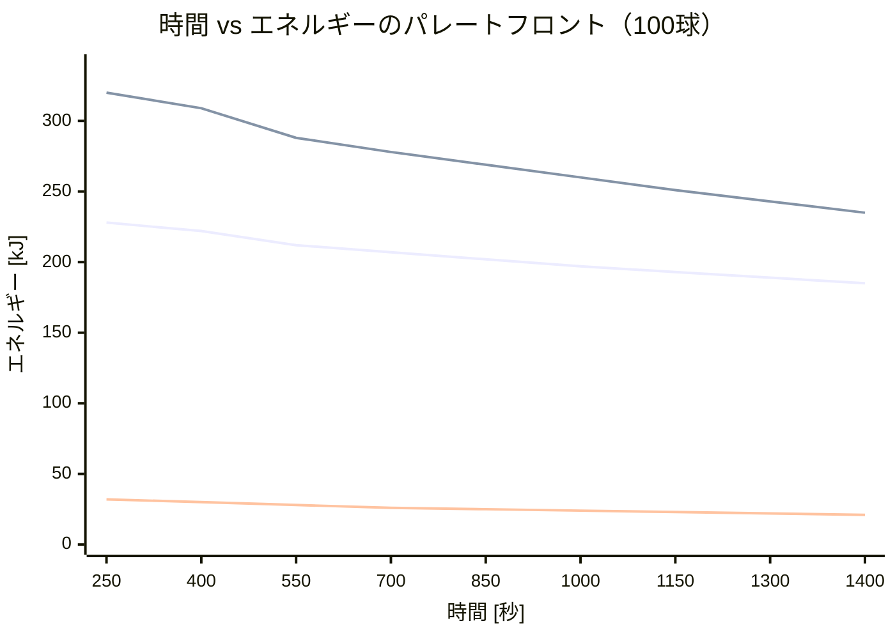

## はじめに — 経路を最適化する

[前回の記事](https://zenn.dev/gyp0bt/articles/tennis-ball-picking-2-energy)では、ボール拾いの3つのエネルギーコスト（歩行・屈伸・運搬）を定式化した。概算で「ホッパーが最強」「屈伸が支配的」という定性的な知見を得た。

しかし、あの計算には決定的な抜けがある。**経路**だ。

100個のボールをどの順番で拾うか——これは巡回セールスマン問題（TSP）の変種であり、訪問順序によって総移動距離は何倍にも変動する。「ボール間の平均距離3 m」という雑な仮定ではなく、実際のボール分布に対して経路最適化を回さなければ、スタイル間の公平な比較はできない。

本記事では、Greedy法（最近傍法）と2-opt局所探索を実装し、4つのスタイルの**時間効率**と**エネルギー効率**をシミュレーションで定量的に比較する。さらに、速度パラメータを変化させることで、**時間 vs エネルギーのパレートフロント**を描き出す。

:::message
本記事は連載第3回です。[第1回（問題設定とモデル化）](https://zenn.dev/gyp0bt/articles/tennis-ball-picking-1-modeling)、[第2回（エネルギーモデル）](https://zenn.dev/gyp0bt/articles/tennis-ball-picking-2-energy)を先にお読みください。
:::

---

## 経路最適化 — TSPの変種として

### 問題の定式化

ボール位置集合 $\{b_i\}_{i=1}^{N}$ とカゴ位置 $B$ が与えられたとき、訪問順序 $\sigma$ を決定変数として以下を最小化する。

**時間最小化:**

$$\min_{\sigma} T_{total} = \sum_{trips} \left[ T_{collect}(trip) + T_{return}(trip) + T_{pick}(trip) \right]$$

**エネルギー最小化:**

$$\min_{\sigma} E_{total} = E_{walk}(\sigma) + E_{bend}(\sigma) + E_{carry}(\sigma)$$

ここで重要なのは、これが純粋なTSPではないことだ。**容量制約**がある。各スタイルには最大積載数 $C$ があり、$C$ 個拾うたびにカゴに戻らなければならない。つまり、これは**容量制約付き巡回配送問題（CVRP: Capacitated Vehicle Routing Problem）**の一種である。

### Greedy法（最近傍法）

最もシンプルなヒューリスティクスだ。カゴから出発し、常に**最も近い未回収ボール**を拾いに行く。容量に達したらカゴに戻って再出発する。

```python
def greedy_nearest_neighbor(ball_positions, basket_position, style):
    remaining = set(range(len(ball_positions)))
    current_pos = basket_position.copy()
    order = []
    carried = 0

    while remaining:
        nearest = min(remaining, key=lambda i: distance(ball_positions[i], current_pos))
        order.append(nearest)
        current_pos = ball_positions[nearest].copy()
        remaining.remove(nearest)
        carried += 1

        if carried >= style.capacity and remaining:
            current_pos = basket_position.copy()
            carried = 0

    return order
```

計算量は $O(N^2)$ で、100球程度なら一瞬で終わる。

### 2-opt局所探索

Greedy法の解を改善する古典的な手法だ。トリップ内の2辺を入れ替えて、総距離が短くなれば採用する。これを改善がなくなるまで繰り返す。

```python
def two_opt_improve(order, ball_positions, basket_position, style):
    trips = split_into_trips(order, style.capacity)
    improved = []
    for trip in trips:
        # トリップ内で2-opt改善
        best = trip
        for i in range(len(best) - 1):
            for j in range(i + 1, len(best)):
                candidate = best[:i] + best[i:j+1][::-1] + best[j+1:]
                if trip_distance(candidate) < trip_distance(best):
                    best = candidate
        improved.extend(best)
    return improved
```

2-optはトリップ内の経路を短縮するが、トリップ間のボール割り当ては変更しない。この制約により計算量は管理可能だが、大域的最適解を保証しない。

---

## シミュレーション結果

### 実験設定

- **コート**: ITF公式ダブルスコート（有効領域 36.6 m × 18.3 m）
- **ボール数**: 100球
- **分布**: ストローク練習モデル（ベースライン帯60%, ネット帯15%, サイド帯15%, バックフェンス帯10%）
- **カゴ位置**: ネット脇 $(5.99, 0.0)$
- **体重**: 60 kg

### 4スタイルの比較結果

| スタイル | 時間 [秒] | エネルギー [kJ] | トリップ数 | 支配的コスト |
|---------|----------|----------------|-----------|-------------|
| **Style A** ラケット載せ | 897 | 204 | 20 | 屈伸 (54%) |
| **Style B** 手拾い直行 | 912 | 274 | 34 | 歩行 (59%) |
| **Style C** 打ち飛ばし | 347 | 23 | 1 | 歩行 (100%) |
| **Style D** ホッパー | 310 | 26 | 2 | 歩行 (97%) |

この結果から、いくつかの構造的な知見が見える。

### 知見 1: 時間とエネルギーの乖離

Style A と Style B は時間がほぼ同じ（897 vs 912秒）だが、**エネルギーは1.3倍も異なる**（204 vs 274 kJ）。この差は主に歩行エネルギーから来ている。Style B は容量3球と小さいため、カゴへの往復が34回にも及び、歩行距離が大きくなる。

逆に Style C と Style D は**エネルギーがほぼ同じ**（23 vs 26 kJ）だが、どちらも屈伸がゼロという共通点を持つ。

### 知見 2: 屈伸コストの支配力

Style A では全エネルギーの**54%**が屈伸コストである。100回の屈伸による累積疲労エネルギーは約111 kJ——これは歩行エネルギー92 kJを上回る。前回の概算（35〜44%）よりさらに大きな割合だ。

$$\frac{E_{bend}}{E_{total}} = \frac{110{,}957}{204{,}141} = 0.54$$

### 知見 3: 2-opt改善の効果はスタイル依存

| スタイル | Greedy時間 | 2-opt時間 | 改善率 |
|---------|-----------|----------|--------|
| Style A | 909秒 | 897秒 | 1.4% |
| Style B | 915秒 | 912秒 | 0.3% |
| Style C | 384秒 | 347秒 | **9.6%** |
| Style D | 338秒 | 310秒 | **8.4%** |

容量が大きいスタイル（C: 100球, D: 72球）では2-optの改善効果が顕著だ。これは直観的にも理解できる——長いトリップほど、経路内に「遠回り」が含まれやすく、2辺の入れ替えで短縮できる余地が大きい。一方、容量の小さいStyle B（3球）ではトリップが短すぎて改善の余地がほぼない。

---

## パレートフロント — 速さと楽さのトレードオフ

### パレートフロントとは

「最も速い拾い方」と「最も楽な拾い方」は同じか？

この問いに答えるため、**多目的最適化**の枠組みでパレートフロントを構成する。移動速度を0.6倍〜1.4倍に変化させることで、時間とエネルギーのトレードオフを探索する。速く歩くほど時間は短くなるが、歩行エネルギーは速度の2次関数 $c_{walk}(v) = \alpha_0 + \alpha_1 v + \alpha_2 v^2$ で増加する。

### 3スタイルのパレートフロント



:::message
Style C は打ち飛ばしフェーズの特殊性から速度パラメータの変化が限定的であるため、パレートフロント図ではStyle A, B, D の3スタイルを比較している。
:::

### パレートフロントの構造

3つのスタイルのパレートフロントには明確な**階層構造**がある。

1. **Style D（ホッパー）**: 圧倒的に左下に位置する。時間もエネルギーも最小。パレートの意味で他のスタイルを**完全に支配**している。
2. **Style A（ラケット載せ）**: Style B よりエネルギー効率が良い。同じ時間なら常にStyle A の方がエネルギーが少ない。
3. **Style B（手拾い直行）**: 最も非効率。容量の小ささがすべてのメトリクスで不利に働く。

つまり、パレートフロントは「**ホッパーが使えるなら使え、使えなければラケット載せ、手拾いは最後の手段**」という明確な序列を示している。

### パレート最適の意味

Style D のフロントをよく見ると、速度を0.6倍（超ゆっくり）にすると時間は416秒だがエネルギーは21 kJまで下がる。1.4倍（早歩き）だと264秒まで短縮されるがエネルギーは32 kJに増加する。

$$\frac{\Delta E}{\Delta T} = \frac{32{,}000 - 21{,}000}{264 - 416} = \frac{11{,}000}{-152} \approx -72 \text{ J/秒}$$

つまり、1秒短縮するごとに約72 Jの追加エネルギーが必要になる。これが「急ぐコスト」の定量的な表現だ。

---

## 感度分析 — 結果はどれだけ安定か

### ボール数に対する感度

ボール数を20, 50, 80, 100, 150と変化させた場合の Style B の結果。

| ボール数 | 時間 [秒] | エネルギー [kJ] | トリップ数 |
|---------|----------|----------------|-----------|
| 20 | 205 | 55 | 7 |
| 50 | 489 | 137 | 17 |
| 80 | 706 | 209 | 27 |
| 100 | 899 | 271 | 34 |
| 150 | 1,341 | 425 | 50 |

時間・エネルギーともにボール数にほぼ**線形に比例**する。これは、累積疲労のβ係数が小さい（0.007）ため、非線形項の影響が相対的に小さいことを意味する。

ただし、エネルギーの方がわずかに超線形の傾向を持つ。ボール数が20→150に7.5倍になると、時間は6.5倍だがエネルギーは7.7倍に増加する。これは累積疲労の影響であり、大量のボールを拾うほど屈伸の非線形コストが効いてくる。

### 分布パターンに対する感度

同じ100球でも、分布パターンが変わると結果は大きく変動する。

| 分布パターン | 時間 [秒] | エネルギー [kJ] |
|-------------|----------|----------------|
| ストローク練習 | 912 | 274 |
| ボレー練習 | 641 | 212 |

ボレー練習モデルでは時間が**30%短縮**、エネルギーが**23%削減**される。ボレー練習のボールはネット〜サービスライン間に集中するため、ボール間距離が小さくなり、カゴまでの距離も短くなるためだ。

**つまり、最適な拾い方はボール分布に依存する。** ストローク練習のように広範囲に散らばる場合と、ボレー練習のように局所的に集中する場合で、スタイルの優劣が変わる可能性がある。

### ボール配置のランダム性（モンテカルロ分析）

同じ分布パラメータでも、ボールの具体的な落下位置は毎回異なる。この**配置ランダム性**がどれだけ結果を変動させるかを、20回のモンテカルロ試行で評価した。

| スタイル | 時間（平均±標準偏差）| エネルギー（平均±標準偏差）|
|---------|-------------------|------------------------|
| Style A | 899 ± 16 秒 | 204 ± 2 kJ |
| Style B | 914 ± 19 秒 | 274 ± 4 kJ |
| Style D | 300 ± 8 秒 | 24 ± 1 kJ |

変動係数（CV = 標準偏差/平均）はいずれも2%前後であり、**結果は配置のランダム性に対してロバスト**だ。スタイル間の差（例: Style A vs Style D で3倍の差）に比べて、配置による変動は微小である。

---

## Greedy法の限界と構造的考察

### なぜGreedy法は十分に近似的なのか

2-opt改善の効果が限定的（特にStyle A, B）であることは、Greedy法の解がかなり良いことを示唆する。これは以下の理由による。

1. **容量制約がトリップを短くする**: Style B（容量3）では1トリップあたり3球しか拾わない。3点のTSPは自明に最適に近い。
2. **ボール分布の空間的構造**: ストローク練習モデルのボールはゾーンごとにクラスタ化されているため、最近傍法が自然にクラスタを順に巡回する。
3. **カゴ帰還のリセット効果**: カゴに戻るたびに位置がリセットされるため、Greedy法の「近視眼的」な欠点が軽減される。

### より高度な手法の必要性

Style C, D のように容量が大きいスタイルでは、2-optの改善効果が8〜10%に及ぶ。さらに改善するためには、以下の手法が考えられる。

- **3-opt / Or-opt**: より広い近傍を探索する局所探索
- **遺伝的アルゴリズム**: メタヒューリスティクスによる大域的探索
- **OR-Tools のCVRPソルバー**: 工業レベルのソルバーによる厳密解への接近

ただし、本連載の目的はスタイル間の構造的な比較であり、数%の改善よりも**定性的な理解**の方が重要だ。Greedy + 2-optは、この目的に十分な精度を提供する。

---

## まとめ — 数値が語るスタイルの構造

本記事では、100球のストローク練習分布に対して4スタイルの経路最適化を実行し、以下の定量的な知見を得た。

### 主要な結果

1. **Style D（ホッパー）が全メトリクスで最強**: 時間310秒、エネルギー26 kJ。他スタイルを完全に支配。
2. **Style C（打ち飛ばし）が健闘**: 時間347秒、エネルギー23 kJ。屈伸ゼロが効く。
3. **Style A vs B は「時間同等、エネルギー大差」**: ラケット載せの方がエネルギー効率25%良い。
4. **パレートフロントに階層構造**: D > A > B の明確な序列。
5. **2-opt改善は容量依存**: 大容量スタイルで効果大（8〜10%改善）、小容量では微小（0.3%）。
6. **結果は配置ランダム性に対してロバスト**: 変動係数は2%程度。

### 「最速」と「最楽」は一致するか？

パレートフロントの分析から、同一スタイル内では最速と最楽は一致しない（速度のトレードオフが存在する）。しかし、**スタイル間のパレートフロントは交差しない**。つまり、ホッパーを選べば「最速かつ最楽」が同時に達成される。

**最適解は経路の工夫ではなく、道具の選択にある。** これはエンジニアリングにおいても頻出する教訓だ——アルゴリズムの改善より、問題設定（道具や制約）の変更の方がインパクトが大きいことがある。

---

## 次回予告 — 協調の数理

ここまでは1人で全球を拾う「個人最適化」を考えてきた。しかし現実のテニススクールでは6〜12人が同時にボール拾いをする。

次回の記事では、$M$ 人によるコートの**領域分割**と**協調戦略**を数理最適化する。

$$\min_{\{A_j\}} \max_{j=1}^{M} T_j(A_j)$$

全員の完了時間のボトルネック（最も遅い人）を最小化する——ボロノイ分割、均等分割、密度ベース分割の3つの戦略を比較する。

:::message
本連載のシミュレーションコードは [GitHub リポジトリ](https://github.com/gyp0bt/zenn-article/tree/main/simulations/tennis_ball_picking) で公開しています。
:::
